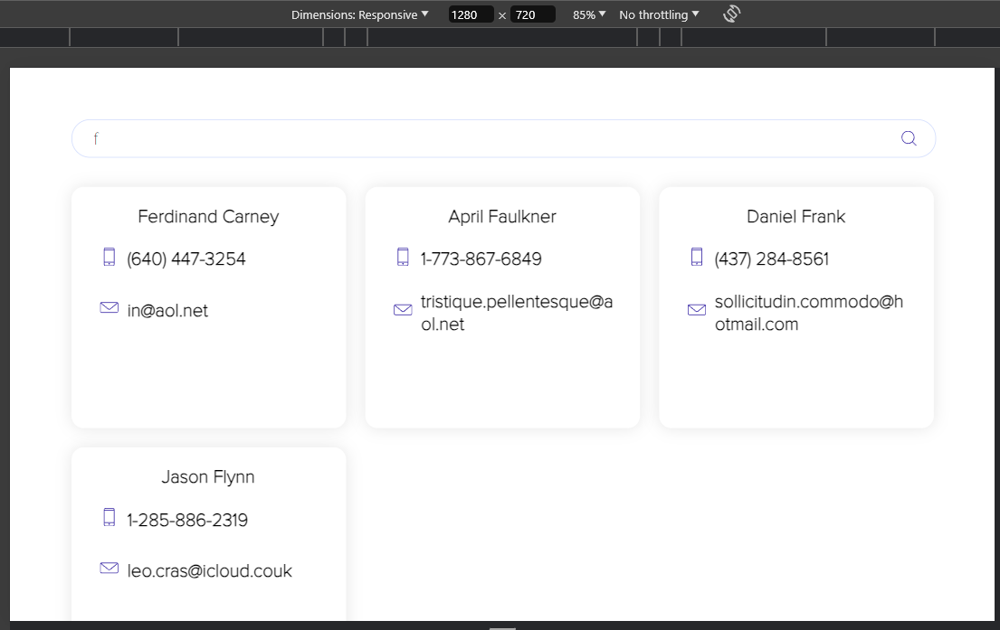
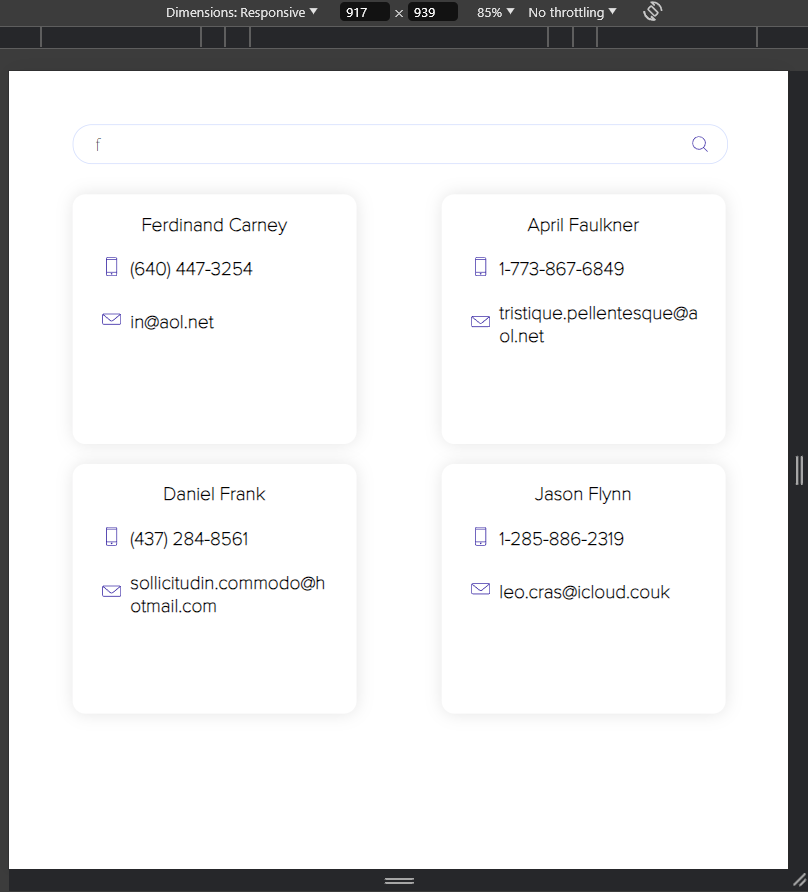
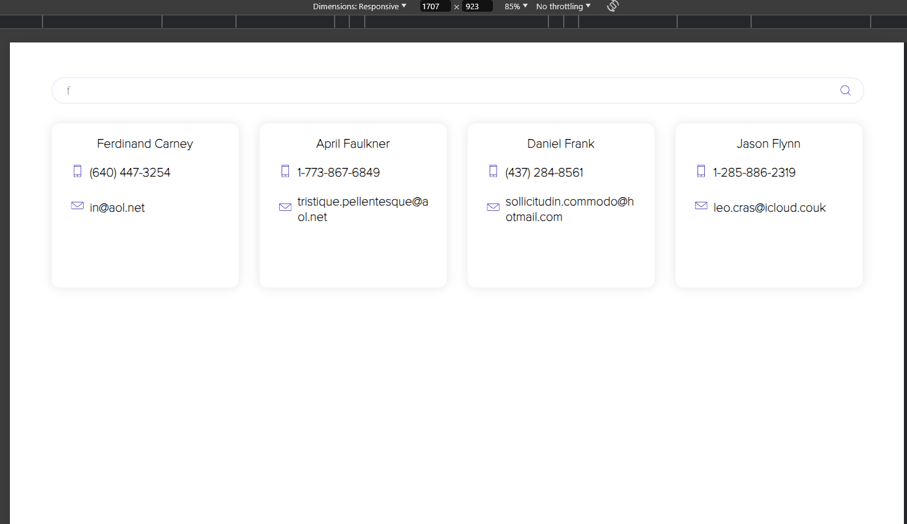
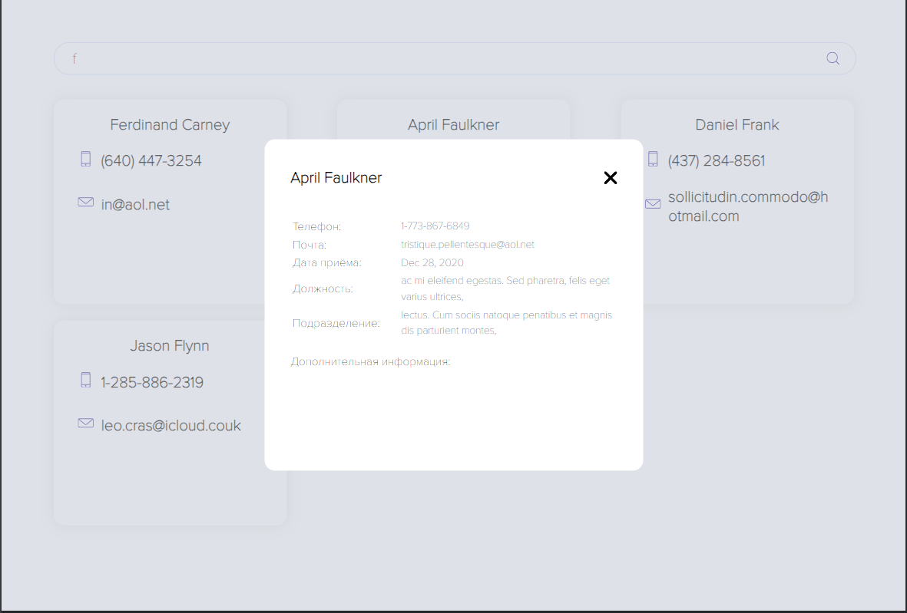

# Тестовое задание 
## Рабочее задание
* Тестовое задание №1. Frontend

Сверстать по макету отчет. В отчете вывести список юзеров. 
На странице есть поиск по юзерам. При вводе в строке поиска список фильтруется.  При клике по карточке выводить в pop-up дополнительную информацию по юзеру. При нажатии вне окна с информацией или крестик окно закрывается.
Список юзеров получаем с бэкенда. Для этого нужно установить  и запустить локально сервер. Ссылка будет такой http://127.0.0.1:3000. Для получения всего списка отправляем запрос без параметров, для получения совпадений ФИО со строкой ввода добавляем параметры query (term), например http://127.0.0.1:3000?term=fer
Ссылка на макет
Ссылка на архив с бэкендом

* Тестовое задание №2. SQL

Написать T-SQL запрос.
Для отладки запроса необходимо скачать SQL Server, а также SSMS. 
	Базу данных с тестовыми таблицами скачать и  экспортировать в SSMS (необходима версия не ниже 2022 г. 19.1)

	В БД есть две таблицы: 
collaborators - таблица сотрудников. Поля: id, name (имя сотрудника), subdivision_id (id подразделения сотрудника), age (возраст).
subdivisions - таблица подразделений. Поля: id, name, parent_id (id родительского подразделения)

Необходимо получить сотрудников всех нижестоящих подразделений от подразделения сотрудника “Сотрудник 1” с id 710253 у которых возраст менее 40 лет. Исключить из результирующей таблицы подразделения с id 100055 и 100059. Отсортировать по возрастанию уровня вложенности подразделения. 

В результирующей таблице должны быть следующие поля: 
id - id сотрудника
name - Имя сотрудника
sub_name - Наименование подразделения
sub_id - id подразделения
sub_level - Уровень вложенности подразделения относительно самого верхнего
colls_count - Общее количество сотрудников в подразделении сотрудника (включая самого сотрудника).

Показать сам запрос (приложить файл в формате .sql), результирующую таблицу и время выполнения запроса.

* Тестовое задание №3. Backend
	
	Скачать и установить дистрибутив ПО WebSoft HCM по ссылке. 

После установки запустите сервер - WebSoft2023.1\WebSoftServer\xHttp_64.exe. Дождитесь надписи Server Started.
Запустите интерфейс администратора - WebSoft2023.1\WebSoftAdmin\SpXml.exe. Логин/пароль - user1/user1.
Во вкладке Персонал -> Сотрудники создайте нового сотрудника, задайте ему логин/пароль и ФИО.
Создайте файл index.html в директории WebSoft2023.1\WebSoftServer\wt\web\
В файле index.html напишите код, который выводит список сотрудников  (ФИО каждого сотрудника с новой строки). Посмотреть результат можно перейдя на localhost/index.html.

	Таблица с сотрудниками называется - collaborators, нужное поле - fullname. Запрос пишется через xquery. 
Серверный код вставляется в html код с помощью <% %> тегов. Выводится с помощью <%= %> тегов.
Ссылка на документацию по ПО - https://developers.websoft.ru

## Тестовое задание №1
При выполнении данного задания был использован сервер на порте 3001 (localhost:3001) поимимо основного (3000) для того, чтобы вынести код React в отдельный файл. Запускать данный проект рекомендуется в Docker'е [compose-файл](Task1/compose.yaml). 

### Результаты
Дизайн страницы - адаптивный. Она может как сужаться, так и растягиваться. Вот несколько примеров на различных экранах:

При клике на карточку выплывает окно, закрыть которое можно либо по нажатию на крестик, либо по нажатию на нейтральную область

## Тестовое задание №2

Комментарии здесь излишни. [БД](Task2/testdb.bacpac), [SQL-запрос](Task2/skript.sql) [Таблица после SQL-запроса](Task2/result.csv), [Файл статистики](Task2/report.rpt).